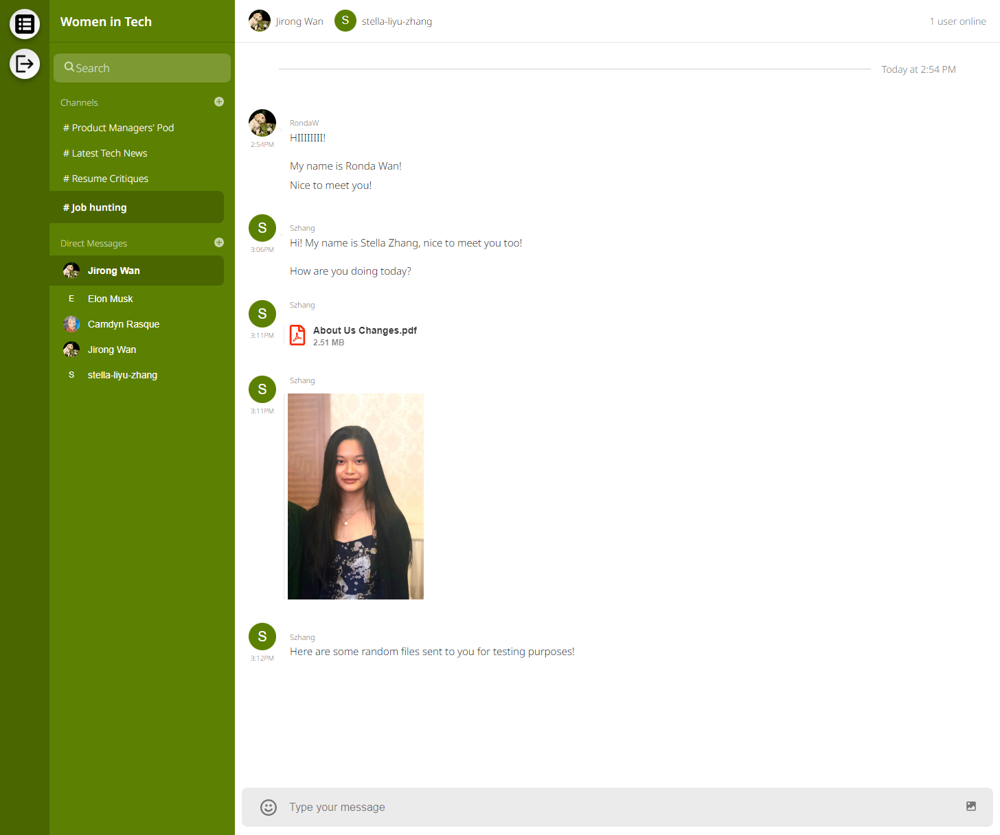

# Slack for Women in Computing

Slack for WIC is a fullstack Real time chat application using ReactJS, HTML5 and CSS3 for frontend, NodeJS and ExpressJS for backend, as well as getstream.io API for real-time chatting functionality. 

I implemented registration, logging in, authentication, Direct messaging and Group Chats, emojis & Reactions, built-in Gif support, the ability to edit & delete messages, specialized commands, and channels with a specific group of people added.
 
> ⭐Stream - https://gstrm.io/js-mastery

**Note:** I'm still figuring out how to securely limit my user group to female and non-binary users. 

## User Stories: 
1) As a woman and a software engineer, I want to use a social networking application with only fellow female tech workers, to talk in a more free, comfortable, and confident way. 
2) As a woman and a Senior product manager, I want to help more girls to crack into and succeed in the competitive tech industry.

## Competitive Product Analysis:
- Tbh Slack is much better than my app. I cannot compete with it. 
- I'm still thinking about how to solve users' pain points in my app.

## Major UIs:

### Sign up form:
The sign up form will require the user's
- full name
- username
- a profile image url
- phone number
- password authentication
.png)

### Sign in form:
The sign in form will query in the database to see if your info (username and password) inputted matches. If matching, the user will be successfully signed in.
.png)

### Direct Messaging box in web:
The real time chat box has some highlights including:
- Sending texts
- Sending medias
    - Sending gifs and emojis
    - Sending documents
    - Sending pictures
- CRUD Functionalities
    - Edit message
    - Delete Message
And other functions including:
    - Pin a message
    - Reply in a thread
    - React to a message with emoji.


### Direct Messaging box in mobile:

### channel in web:

### channel in mobile:


## Requirement
- Web browser supporting React.js (Chrome preferred). See following table for version requirements.
    - Browser:
        - IE (with version = 11)
        - Edge(with version >= 14) Firefox (with version >= 52) Chrome (with version >= 49) Safari (with version >= 10) Googlebot

- Internet connection

## Setup

### To run the client side, navigate to the client folder by
```
cd client
```
if you haven't created the react-app yet, feel free to do so by typing: 
*(./ specifies the directory where we are creating our react app.)*
```
npx create-react-app ./
```
, then run
```
npm start
```

### To run the server side, navigate to the server folder by
```
cd server
```
if you haven't intialized the server yet, feel free to do so by typing
```
npm init -y
```
, then run
```
npm run dev
```

## client side npm dependencies we installed include:
- stream-chat 
- stream-chat-react 
- universal-cookie

## server side npm packages we installed include:
- bcrypt
- crypto
- dotenv
- express
- getstream
- stream-chat
- nodemon
- twilio
